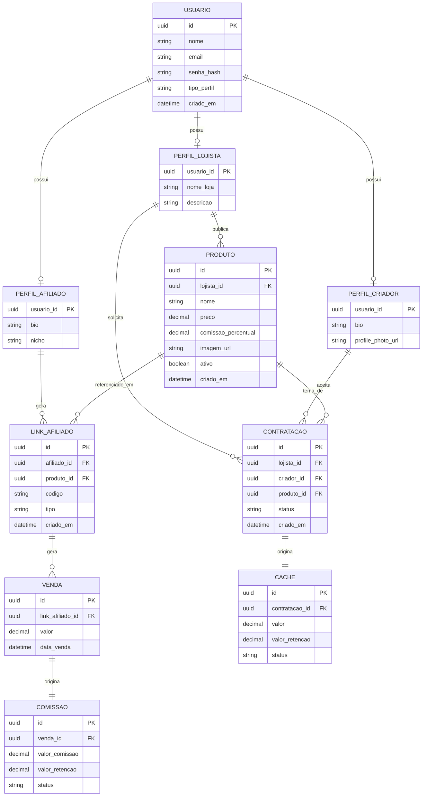

# MyVitrine — Backend

Backend da **MyVitrine**, uma plataforma que conecta lojistas, afiliados e criadores de conteúdo.

A plataforma permite que lojistas cadastrem produtos, que afiliados gerem links e cupons de divulgação com rastreamento de vendas e cálculo automático de comissão, e que lojistas contratem criadores de conteúdo para produção de material promocional, com controle de cachê.

## Sumário

- [Arquitetura](#arquitetura)
- [Modelo de dados](#modelo-de-dados)
- [Tecnologias](#tecnologias)
- [Como rodar](#como-rodar)
- [Como rodar com Docker](#como-rodar-com-docker)
- [Configuração e perfis](#configuração-e-perfis)
- [Autenticação](#autenticação)
- [Endpoints principais](#endpoints-principais)
- [Executar os testes](#executar-os-testes)
- [Documentação da API](#documentação-da-api)

## Arquitetura

O projeto segue uma arquitetura em camadas:

```text
Controller → Service → Repository → Database
```

| Camada | Responsabilidade |
|---|---|
| `Controller` | Recebe as requisições HTTP, valida os dados e retorna as respostas. |
| `Service` | Concentra as regras de negócio e operações transacionais. |
| `Repository` | Responsável pela persistência dos dados utilizando Spring Data JPA. |
| `Model` | Contém as entidades JPA. |
| `DTO` | Define os objetos de entrada e saída da API. |

Estrutura principal:

```text
com.myvitrine.api
├── controller
├── dto
│   ├── request
│   └── response
├── model
├── repository
└── service
```

O banco de dados é gerenciado exclusivamente pelo Flyway. O Hibernate utiliza `ddl-auto=validate` apenas para validar os mapeamentos das entidades — as migrations é que definem o schema.

## Modelo de dados

O diagrama abaixo representa as entidades do MVP e seus relacionamentos: um usuário pode possuir os perfis de lojista, afiliado e/ou criador; lojistas publicam produtos; afiliados geram links para produtos, que originam vendas e comissões; e lojistas podem contratar criadores para produzir conteúdo sobre um produto, gerando um cachê.



> O diagrama é renderizado automaticamente pelo GitHub/GitLab (suporte nativo a Mermaid). Caso visualize em um ambiente sem esse suporte, cole o bloco acima em [mermaid.live](https://mermaid.live).

## Tecnologias

- Java 21
- Spring Boot 4.1.1
- Spring Web MVC
- Spring Data JPA
- PostgreSQL
- Flyway
- Spring Security / OAuth2
- Springdoc OpenAPI
- JUnit 5 e Mockito

## Como rodar com Docker

### Pré-requisitos

- Docker Engine
- Docker Compose

Na raiz do projeto, execute:

```bash
docker compose up --build
```

A API ficará disponível em `http://localhost:8080`. Para executar em segundo plano:

```bash
docker compose up --build -d
```

Para interromper os containers:

```bash
docker compose down
```

Os dados do PostgreSQL são mantidos no volume `postgres_data`. Para removê-los junto com os containers:

```bash
docker compose down -v
```

### Variáveis do Docker Compose

Crie um arquivo `.env` na raiz caso precise alterar os valores padrão:

```dotenv
POSTGRES_DB=myvitrine
POSTGRES_USER=postgres
POSTGRES_PASSWORD=123456
POSTGRES_PORT=5432
API_PORT=8080
CORS_ORIGINS=http://localhost:5173
JWT_COOKIE_SECURE=false
```

Em produção, use uma senha forte, mantenha `JWT_COOKIE_SECURE=true` quando a API estiver atrás de HTTPS e configure chaves RSA persistentes em `JWT_PRIVATE_KEY` e `JWT_PUBLIC_KEY`. Sem essas chaves, a aplicação gera um par temporário apenas para desenvolvimento.

## Como rodar

### Pré-requisitos

- Java 21
- PostgreSQL
- Maven

### Configuração do banco

Crie o banco:

```sql
CREATE DATABASE myvitrine;
```

Configure as credenciais por variáveis de ambiente ou no `application.yml`:

```bash
DB_URL=jdbc:postgresql://localhost:5432/myvitrine
DB_USERNAME=postgres
DB_PASSWORD=postgres
```

O Hibernate usa `ddl-auto=validate`; a estrutura do banco é criada e atualizada exclusivamente pelas migrations do Flyway.

### Executar a aplicação

Linux/macOS:

```bash
./mvnw spring-boot:run
```

Windows:

```bash
mvnw.cmd spring-boot:run
```

As migrations do Flyway são executadas automaticamente ao iniciar a aplicação.

## Configuração e perfis

O perfil padrão é adequado para desenvolvimento local. As propriedades podem ser
definidas por variáveis de ambiente ou sobrescritas em `application.yml`.

| Variável | Padrão local | Descrição |
|---|---|---|
| `DB_URL` | `jdbc:postgresql://localhost:5432/myvitrine` | URL JDBC do PostgreSQL. |
| `DB_USERNAME` | `postgres` | Usuário do banco. |
| `DB_PASSWORD` | vazio | Senha do banco. |
| `CORS_ORIGINS` | `http://localhost:5173` | Origens permitidas pelo CORS. |
| `JWT_PRIVATE_KEY` | vazio | Chave privada RSA usada para assinar access tokens. |
| `JWT_PUBLIC_KEY` | vazio | Chave pública RSA usada para validar access tokens. |
| `JWT_COOKIE_SECURE` | `false` | Define se o cookie de refresh exige HTTPS. |

Para produção, ative o perfil e forneça todas as configurações obrigatórias:

```bash
SPRING_PROFILES_ACTIVE=prod
DB_URL=jdbc:postgresql://<host>:5432/myvitrine
DB_USERNAME=<usuario>
DB_PASSWORD=<senha>
CORS_ORIGINS=https://<frontend>
JWT_PRIVATE_KEY=<chave-privada-rsa>
JWT_PUBLIC_KEY=<chave-publica-rsa>
```

No perfil `prod`, a documentação OpenAPI fica desabilitada e o cookie de refresh
é configurado para funcionar somente com HTTPS. Não versione chaves ou senhas.

## Autenticação

1. Faça `POST /api/users` para criar um usuário.
2. Faça `POST /api/auth/login` com e-mail e senha. A resposta contém o access token;
    o refresh token é enviado em um cookie `httpOnly`.
3. Envie o access token nas requisições protegidas:

```http
Authorization: Bearer <access-token>
```

4. Quando o access token expirar, faça `POST /api/auth/refresh` incluindo o cookie
    de refresh. O token é rotacionado.
5. Para encerrar a sessão, faça `POST /api/auth/logout`.

As permissões são derivadas do tipo de perfil (`STORE`, `AFFILIATE` ou `CREATOR`).
O refresh token não deve ser enviado no header `Authorization`.

## Endpoints principais

Todos os endpoints usam o prefixo `/api`:

| Grupo | Prefixo | Finalidade |
|---|---|---|
| Autenticação | `/auth` | Login, renovação e logout. |
| Usuários | `/users` | Cadastro e gerenciamento de usuários. |
| Perfil de lojista | `/store-profiles` | Cadastro e gerenciamento do perfil da loja. |
| Perfil de afiliado | `/affiliate-profiles` | Cadastro e gerenciamento do perfil de afiliado. |
| Perfil de criador | `/creator-profiles` | Cadastro e gerenciamento do perfil de criador. |
| Produtos | `/products` | Catálogo, produtos próprios e dashboard do lojista. |
| Links de afiliado | `/affiliate-links` | Criação e consulta de links/cupons de divulgação. |
| Vendas | `/sales` | Registro e consulta de vendas. |
| Comissões | `/commissions` | Consulta de comissões geradas. |
| Contratações | `/hirings` | Contratação de criadores e dashboards relacionados. |
| Cachês | `/creator-fees` | Consulta dos cachês de criadores. |

As listagens paginadas aceitam os parâmetros `page`, `size` e `sort`. Por exemplo:

```text
GET /api/products?page=0&size=20&sort=createdAt,desc
```

## Executar os testes

Linux/macOS:

```bash
./mvnw test
```

Windows:

```powershell
./mvnw.cmd test
```

Os testes usam H2 quando necessário e não exigem um PostgreSQL externo, salvo se
algum teste específico for configurado para isso.

## Documentação da API

A API utiliza OpenAPI/Swagger para documentar os endpoints e seus modelos.

Com a aplicação no perfil padrão, acesse:

- Interface Swagger: `http://localhost:8080/swagger-ui.html`
- Especificação OpenAPI: `http://localhost:8080/v3/api-docs`

Essas rotas são públicas no perfil padrão e ficam desabilitadas em `prod`.
