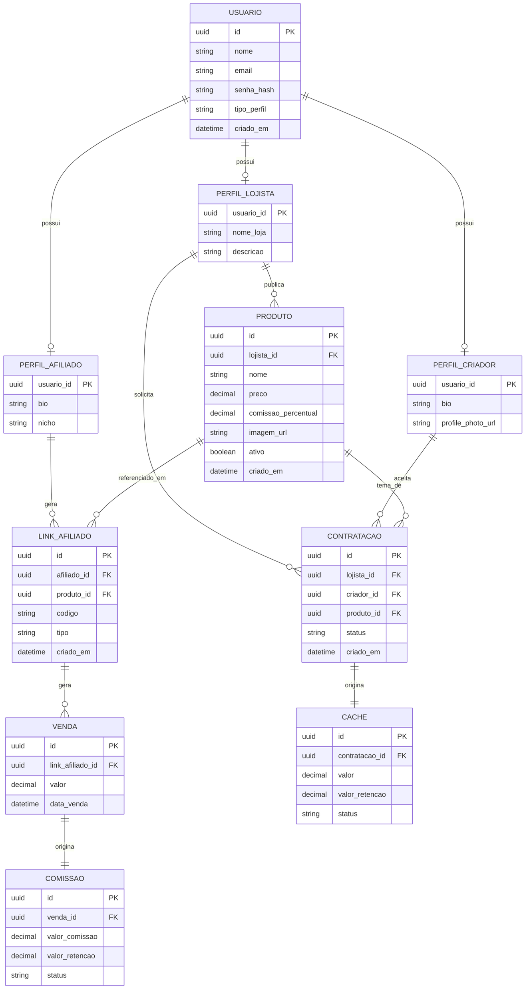

# MyVitrine — Backend

Backend da **MyVitrine**, uma plataforma que conecta lojistas, afiliados e criadores de conteúdo.

A plataforma permite que lojistas cadastrem produtos, que afiliados gerem links e cupons de divulgação com rastreamento de vendas e cálculo automático de comissão, e que lojistas contratem criadores de conteúdo para produção de material promocional, com controle de cachê.

## Sumário

- [Arquitetura](#arquitetura)
- [Modelo de dados](#modelo-de-dados)
- [Tecnologias](#tecnologias)
- [Como rodar](#como-rodar)
- [Executar os testes](#executar-os-testes)
- [Documentação da API](#documentação-da-api)

## Arquitetura

O projeto segue uma arquitetura em camadas:

```text
Controller → Service → Repository → Database
```

| Camada | Responsabilidade |
|---|---|
| `Controller` | Recebe as requisições HTTP, valida os dados e retorna as respostas. |
| `Service` | Concentra as regras de negócio e operações transacionais. |
| `Repository` | Responsável pela persistência dos dados utilizando Spring Data JPA. |
| `Model` | Contém as entidades JPA. |
| `DTO` | Define os objetos de entrada e saída da API. |

Estrutura principal:

```text
com.myvitrine.api
├── controller
├── dto
│   ├── request
│   └── response
├── model
├── repository
└── service
```

O banco de dados é gerenciado exclusivamente pelo Flyway. O Hibernate utiliza `ddl-auto=validate` apenas para validar os mapeamentos das entidades — as migrations é que definem o schema.

## Modelo de dados

O diagrama abaixo representa as entidades do MVP e seus relacionamentos: um usuário pode possuir os perfis de lojista, afiliado e/ou criador; lojistas publicam produtos; afiliados geram links para produtos, que originam vendas e comissões; e lojistas podem contratar criadores para produzir conteúdo sobre um produto, gerando um cachê.



> O diagrama é renderizado automaticamente pelo GitHub/GitLab (suporte nativo a Mermaid). Caso visualize em um ambiente sem esse suporte, cole o bloco acima em [mermaid.live](https://mermaid.live).

## Tecnologias

- Java 21
- Spring Boot 4.1.1
- Spring Web MVC
- Spring Data JPA
- PostgreSQL
- Flyway
- Spring Security / OAuth2
- Springdoc OpenAPI
- JUnit 5 e Mockito

> A implementação de autenticação e autorização não faz parte do escopo atual.

## Como rodar

### Pré-requisitos

- Java 21
- PostgreSQL
- Maven

### Configuração do banco

Crie o banco:

```sql
CREATE DATABASE myvitrine;
```

Configure as credenciais no `application.properties`:

```properties
spring.datasource.url=jdbc:postgresql://localhost:5432/myvitrine
spring.datasource.username=postgres
spring.datasource.password=postgres

spring.jpa.hibernate.ddl-auto=validate
```

### Executar a aplicação

Linux/macOS:

```bash
./mvnw spring-boot:run
```

Windows:

```bash
mvnw.cmd spring-boot:run
```

As migrations do Flyway são executadas automaticamente ao iniciar a aplicação.

## Executar os testes

```bash
./mvnw test
```

## Documentação da API

A API utiliza OpenAPI/Swagger para documentação dos endpoints.

Após iniciar a aplicação, a documentação pode ser acessada pela interface do Swagger configurada pelo Springdoc, normalmente em `http://localhost:8080/swagger-ui.html`.
